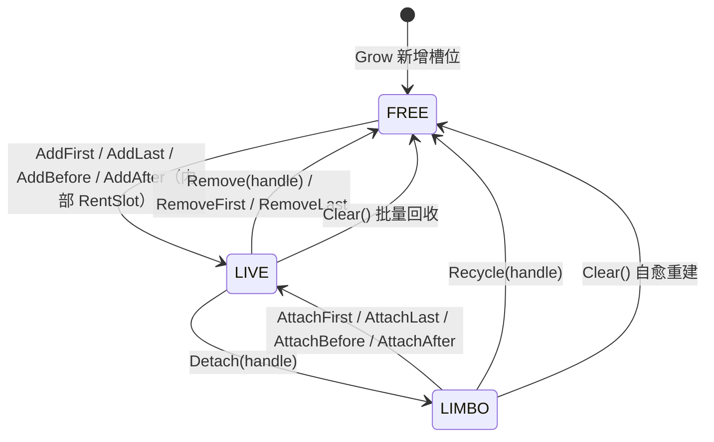

# PooledLinkedList 设计说明

> 相关文件
> - 链表实现：`SharedProject/SharedSource/Collections/PooledLinkedList.cs`（`PooledLinkedListNode` / `PooledLinkedList<T>`）
> - 唯一调用点：`ClientProject/ClientSource/Culling/PluginClient.cs`（`shadowIndexLinkedList`、`shadowClippingOccluders`、`segmentListPool`）
> - 上游池化层：[`ObjectPool.md`](./ObjectPool.md)（`ObjectPool<T>` / `PooledLease<T>` / `IPool<T>`）
>
> 环境：.NET 8 / `Nullable=enable` / `LangVersion=latest`，无新增依赖。

---

## 目录

1. [背景：旧实现的问题](#1-背景旧实现的问题)
2. [重设计目标](#2-重设计目标)
3. [总体架构](#3-总体架构)
4. [API 一览](#4-api-一览)
5. [数据结构](#5-数据结构)
6. [核心流程](#6-核心流程)
7. [索引安全与并发论证](#7-索引安全与并发论证)
8. [与调用点的集成](#8-与调用点的集成)
9. [性能特性](#9-性能特性)
10. [基础概念小抄](#10-基础概念小抄)
11. [契约与注意事项](#11-契约与注意事项)
12. [观测与调优](#12-观测与调优)
13. [术语速查表](#13-术语速查表)
14. [附录 A：小白版 —— 旅馆行李寄存比喻](#14-附录-a小白版--旅馆行李寄存比喻)

---

## 1. 背景：旧实现的问题

旧实现是一个「节点为堆对象 + 侵入式环形双向链表 + 内部空闲链」的结构，调用方拿到的是
`PooledLinkedListNode<T>` **对象引用**。逐条问题如下：

| # | 问题 | 说明 |
| --- | --- | --- |
| 1 | **`Clear()` 默认不归还节点** | 签名是 `Clear(bool returnNode = false)`，默认只 `Invalidate()` 而不把节点推回空闲链，节点直接变成垃圾。三个调用点全部显式写 `Clear(returnNode: true)`，说明这个默认值是纯粹的错误默认 |
| 2 | **`ReturnNode` 是破坏性入口** | 不校验、不解除链接，对仍在链上的节点调用会直接把环链的 `_next` 拿去串空闲链；也不清 `_prev`、不清 `_list`，与 `ValidateNewNode` 的归属判定自相矛盾 |
| 3 | **值检索 API 有装箱与死分支** | `s_comparer` 声明后从未使用；`Find` / `FindLast` 每次都重新取 `EqualityComparer<T>.Default`，且内含 `value != null` / `node._item == null` 分支——`T` 未约束，在本仓库真实用例 `T = int` 上恒真并可能装箱 |
| 4 | **导航属性会 NRE** | `Next` / `Previous` 在 `_list` 为 `null` 时于属性内部解引用 `_list!._head` |
| 5 | **每节点一次堆分配** | 每个节点是独立对象：对象头 + 3 个引用字段（`_list` / `_next` / `_prev`）+ 数据，且首次填充列表时逐个分配 |
| 6 | **`_list` 反向引用常驻** | 每个节点多 8 字节，只为 `ValidateNode` 做归属校验 |
| 7 | **缺少现代列表成员** | 无 `Capacity` / `EnsureCapacity`；`RemoveFirst` / `RemoveLast` 只有抛异常版本 |

---

## 2. 重设计目标

| 维度 | 结论 |
| --- | --- |
| 总体 | 彻底重设计：从「堆对象节点 + 对象引用句柄」改为「结构体数组 + 稳定索引句柄」 |
| 语义 | 三态槽位模型（LIVE / FREE / LIMBO），把「摘除但保留」与「摘除并回收」拆成两个语义明确的操作 |
| 句柄 | 4 字节只读结构体 `PooledLinkedListNode`，无列表反向引用，可跨数组扩容保持有效 |
| 内存 | 节点存于 `T[] _items` + `int[] _next` + `int[] _prev` 三个平行数组（SoA），消除对象头与每节点分配 |
| 校验 | 常驻归属校验 → 调试期断言 + 文档契约（Release 零开销） |
| API | 删除值检索类 API，统一 `in T` 传参，补齐 XML 文档 |
| 兼容性 | 允许破坏性变更，调用点一并迁移；**不改变剔除算法行为** |
| 线程模型 | 明确声明「非线程安全」，不引入任何锁或原子操作 |

---

## 3. 总体架构

节点存放在链表自有的连续数组里，调用方只持有 4 字节句柄。链表本身是一个**环形**双向链表（`_head` 的
`Prev` 即尾节点），另外维护一条 **LIFO 空闲链**贯穿未被占用的槽位。

```
            AddFirst / AddLast / AddBefore / AddAfter
                          │
                          ▼
                 RentSlot()   ← 先从空闲链取槽位
                          │        空闲链空 → Grow() 数组翻倍
                          ▼
   ┌──────────────────────────────────────────────────────────┐
   │  _items[] + _next[] + _prev[]（见 §5.0）                  │
   │  ┌────┬────┬────┬────┬────┬────┬────┐                    │
   │  │ 0  │ 1  │ 2  │ 3  │ 4  │ 5  │ 6  │  …                 │
   │  └─┬──┴─┬──┴─┬──┴─┬──┴─┬──┴─┬──┴─┬──┘                    │
   │    │    │    │    │    │    │    │                        │
   │    │    └────┴────┴──┐ │    │    │                        │
   │    └────────────▲    │ │    │    │                        │
   │       环（LIVE）│    │ │    │    │                        │
   │                 └────┘ └────┴────┘                        │
   │                      空闲链（FREE，LIFO）                 │
   └──────────────────────────────────────────────────────────┘
                          │
                          ▼
                  PooledLinkedListNode
                  （4 字节，只存槽位下标）
```

**槽位状态机**（新设计的核心语义）：



设计要点：

- **槽位三态互斥且完备**：不变式 `Count + FreeCount + LimboCount == Capacity` 恒成立。
- **句柄是索引，不是引用**：数组扩容不会移动已有节点，因此句柄在扩容后仍然有效——这是索引句柄相对对象引用的等价优点。
- **任何 slot 都不会被"无条件保留"**：`Clear()` 一定会把它们全部收回空闲链，池不会无限增长。

---

## 4. API 一览

### 4.1 `PooledLinkedListNode`（句柄）

```csharp
public readonly struct PooledLinkedListNode : IEquatable<PooledLinkedListNode>
{
    public static PooledLinkedListNode None { get; }   // 空句柄，等价于 default
    public int  Index   { get; }                       // 槽位下标；空句柄为 -1
    public bool IsValid { get; }                       // 是否指向一个节点
    public bool IsNull  { get; }                       // 是否为空句柄

    public bool Equals(PooledLinkedListNode other);
    public static bool operator ==(PooledLinkedListNode left, PooledLinkedListNode right);
    public static bool operator !=(PooledLinkedListNode left, PooledLinkedListNode right);
}
```

> **为什么不能直接用 `int` 当句柄？**
> `shadowIndexLinkedList` 的元素类型恰好就是 `int`。若句柄是裸 `int`，那么在 `PooledLinkedList<int>` 上
> `AddAfter(anchor, value)` 与 `AddAfter(anchor, node)` 会展开成同一个签名 `AddAfter(int, int)`，编译期直接冲突。
> 因此句柄**必须是一个独立类型**——这既是封装需要，也是编译期的硬约束。

> **`_index` 直接存槽位下标，没有任何偏移。**
> 早期版本为了「全零即空句柄」的安全性，存的是「槽位 + 1」。但遍历的依赖链是
> `slot -> Next(slot) -> handle -> slot`，这个偏移会变成链上的加减各一条指令，实测让遍历慢约 9%。
> 现在直存，代价是 **`default(PooledLinkedListNode)` 指向 0 号槽位而不是「空」** ——
> 因此**必须写 `PooledLinkedListNode.None`，不要用 `default`**。

### 4.2 `PooledLinkedList<T>` 成员

| 分类 | 成员 | 说明 |
| --- | --- | --- |
| 构造 | `PooledLinkedList()` | 数组从空开始，按需增长 |
| 构造 | `PooledLinkedList(int initialCapacity)` | 预分配槽位并全部挂上空闲链 |
| 计数 | `int Count` | LIVE 节点数 |
| 计数 | `int FreeCount` | 空闲链上的槽位数 |
| 计数 | `int LimboCount` | 已摘除且未回收的槽位数（稳态恒为 0） |
| 容量 | `int Capacity` | 底层数组长度 |
| 容量 | `void EnsureCapacity(int capacity)` | 保证不扩容；已有节点不受影响 |
| 端点 | `PooledLinkedListNode First` / `Last` | 空表返回 `None` |
| 插入 | `AddFirst(in T)` / `AddLast(in T)` | 返回新节点句柄 |
| 插入 | `AddBefore(handle, in T)` / `AddAfter(handle, in T)` | 锚点必须为 LIVE |
| 挂回 | `AttachFirst(handle)` / `AttachLast(handle)` | LIMBO → LIVE |
| 挂回 | `AttachBefore(handle, detached)` / `AttachAfter(handle, detached)` | LIMBO → LIVE |
| 导航 | `Next(handle)` / `Previous(handle)` | 到头返回 `None` |
| 取值 | `this[handle]`（get/set） | 值语义访问 |
| 取值 | `ref T ValueRef(handle)` | 引用语义访问，见 §11.2 禁忌 |
| 摘除 | `void Detach(handle)` | LIVE → LIMBO，**不回收槽位** |
| 回收 | `void Recycle(handle)` | LIMBO → FREE |
| 移除 | `void Remove(handle)` | Detach + Recycle |
| 移除 | `RemoveFirst()` / `RemoveLast()` | 空表抛 `InvalidOperationException` |
| 移除 | `bool TryRemoveFirst()` / `TryRemoveLast()` | 空表返回 `false` |
| 清空 | `void Clear()` | 全部槽位回到空闲链，**保留数组容量** |
| 枚举 | `Enumerator GetEnumerator()` | 结构体枚举器 + 版本号校验 |

> **没有 `IList<T>` / `ICollection<T>` 实现，也没有 `Contains` / `Find` / `Remove(in T)`.**
> 这些检索类 API 在本仓库没有任何调用点，而它们正是旧实现里 `EqualityComparer` 冗余与值类型装箱缺陷的来源，
> 因此被整体删除。枚举只需要 `IEnumerable<T>`，`IReadOnlyCollection<T>` 提供 `Count`。

### 4.3 用法示例

```csharp
// 一个长期存活、反复填充与清空的切割列表（由 ObjectPool 托管）
using var lease = segmentListPool.RentLease(out PooledLinkedList<Segment> edges);

edges.AddLast(segment);

PooledLinkedListNode node = edges.First;
while (node.IsValid)
{
    PooledLinkedListNode next = edges.Next(node);       // 先取 next，再删当前
    ref readonly Segment edge = ref edges.ValueRef(node);
    if (ShouldDrop(edge)) { edges.Remove(node); }
    node = next;
}

edges.Clear();                                          // 槽位全部回收，数组保留
```

---

## 5. 数据结构

### 5.0 为什么载荷和链接分成三个数组（SoA）

载荷 `_items`、后继 `_next`、前驱 `_prev` 是**三个独立数组**，而不是「一个 `Node[]` 数组，每个元素装 `{ T Item; int Next; int Prev; }`」。
这个选择是实测倒逼出来的：链表几乎总是被**遍历**而不是被索引，所以遍历 `slot -> Next(slot) -> slot` 是所有调用点里最热的操作，
而这个循环的耗时**完全由循环携带依赖链的长度决定**。

| 布局 | 单步依赖链 | 说明 |
| --- | --- | --- |
| AoS（`Node[]`，24 字节/节点） | `slot → lea(3*slot) → 加载 Next → slot` | 24 字节不是 2 的幂，地址必须先经一条 `lea` 把下标乘 3，这条 `lea` 落在关键路径上；且链接与 16 字节的载荷混在一行里，追逐环时缓存行利用率低 |
| **SoA（`int[] _next`，4 字节/节点）** | `slot → 加载 Next → slot` | 4 字节可用寻址单元自带的 `*4` 缩放直接寻址，关键路径只剩一次加载；链接数组密度提升 4 倍，缓存行数与旧的对象引用实现持平 |

同一份遍历负载（64 节点环 × 20 万轮）在三种布局上的实测：

```
AoS（结构体数组，24 字节节点） : 50.98 ms
SoA（int[] 链接）             : 21.90 ms   ← 快 2.3 倍
对象引用追逐（旧实现）         : 18.06 ms
```

代价只是每个链表多两个数组头（约 64 字节），单位节点的总字节数与 AoS 完全相同（`Segment` 下均为 24 字节/节点）。
另外它顺带降低了触发 LOH 的风险：链接数组 4 字节/节点，要到 2 万多个节点才可能进入大对象堆。

### 5.1 字段

| 字段 | 类型 | 作用 |
| --- | --- | --- |
| `_items` | `T[]` | 槽位载荷，按槽位下标索引 |
| `_next` | `int[]` | 环中后继槽位；槽位在空闲链上时是空闲链的后继 |
| `_prev` | `int[]` | 环中前驱槽位；LIVE 为下标，LIMBO 为 `NoLink`，FREE 为 `FreeMarker` |
| `_head` | `int` | 环头槽位下标；空表为 `NoLink` |
| `_count` | `int` | LIVE 节点数 |
| `_freeHead` | `int` | 空闲链栈顶；空链为 `NoLink` |
| `_freeCount` | `int` | 空闲链长度 |
| `_version` | `int` | 结构变更计数，供枚举器检测并发修改 |

### 5.2 两个特殊下标

```csharp
private const int NoLink     = -1;   // 「无链接」：Detach 后的槽位、空表的 _head、空闲链的尾部
private const int FreeMarker = -2;   // 「在空闲链上」：只写在 Prev 里
```

节点用**环形**链表，所以没有 `null` 前驱/后继的概念。为了能用 O(1) 判断槽位处于哪个状态（而不额外维护一个
状态数组），把标记塞进了 `_prev`：

| 状态 | `_prev[slot]` 的值 | `_next[slot]` 的值 |
| --- | --- | --- |
| LIVE | 环中前驱的下标（`>= 0`） | 环中后继的下标 |
| LIMBO | `NoLink` (`-1`) | `NoLink` (`-1`) |
| FREE | `FreeMarker` (`-2`) | 空闲链中的下一个槽位 |

于是：

```csharp
ValidateLive(slot)   => slot >= 0 && slot < Capacity && _prev[slot] >= 0
IsDetachedSlot(slot) => slot >= 0 && slot < Capacity && _prev[slot] == NoLink
```

单节点环的自引用（`Next == Prev == slot`）也满足 `Prev >= 0`，判定依旧正确。**这套标记本身不占额外空间**。

### 5.3 空闲链为什么是 LIFO

`RecycleSlot` 把槽位压到栈顶，`RentSlot` 从栈顶取。刚被释放的槽位，其内存（以及它引用的子结构）大概率还在
CPU 的 L1/L2 缓存里，取回来即是缓存命中；FIFO 拿到的可能是很久以前的对象，早已被换出到主存，要重新加载。
这与 `ObjectPool.ThreadLocalCache` 的 LIFO 设计一致。

### 5.4 为什么 `Clear()` 不收缩数组

`segmentListPool` 的 `onReturn` 依赖 `Clear()` 把槽位收回空闲链而**保留容量**——否则每轮剔除都要重新分配数组，
池化的意义就没了。因此本类型**刻意不提供 `TrimExcess()`**：池化场景下收缩只会带来反复扩容。

---

## 6. 核心流程

### 6.1 `RentSlot` / `RecycleSlot`

```csharp
private int RentSlot(in T value)
{
    if (_freeHead == NoLink) { Grow(); }      // 空闲链空 → 数组翻倍，新槽位全部挂上空闲链

    int slot = _freeHead;
    _freeHead = _next[slot];                  // 弹栈
    _freeCount--;

    _items[slot] = value;
    _next[slot] = NoLink;
    _prev[slot] = NoLink;                     // 暂置 LIMBO，随后由 Insert* 接进环
    return slot;
}

private void RecycleSlot(int slot)
{
    if (RuntimeHelpers.IsReferenceOrContainsReferences<T>())
    {
        _items[slot] = default!;              // 关键：不置空则空闲链会长期强引用已归还的对象
    }

    _prev[slot] = FreeMarker;
    _next[slot] = _freeHead;
    _freeHead = slot;                         // 压栈
    _freeCount++;
}
```

`RuntimeHelpers.IsReferenceOrContainsReferences<T>()` 是 JIT 内建，对值类型会常量折叠为 `false`，
因此 `T = int` / `T = Segment` 时这一整块会被完全消除。

### 6.2 插入：`InsertBefore` 是唯一的链接原语

环形链表里「在 X 之前插入」就能表达全部四种插入（首、尾、前、后），所以只实现一个：

```csharp
private void InsertBefore(int anchor, int slot)
{
    int previous = _prev[anchor];

    _next[slot] = anchor;
    _prev[slot] = previous;

    _prev[anchor] = slot;
    _next[previous] = slot;

    _count++;
    _version++;
}
```

| 公开方法 | 组合方式 | 备注 |
| --- | --- | --- |
| `AddFirst` | `InsertBefore(_head)` + `_head = slot` | 空表走 `InsertIntoEmpty` |
| `AddLast` | `InsertBefore(_head)` | 环中 `_prev[_head]` 就是尾 |
| `AddBefore(a)` | `InsertBefore(a)` + 若 `a == _head` 则更新头 | |
| `AddAfter(a)` | `InsertBefore(_next[a])` | |

`AddAfter` 中锚点的 `Next` 是**在 `RentSlot` 之后**才读取的，因为 `RentSlot` 可能触发扩容换掉整个数组（`AttachAfter` 不取槽位，直接读 `_next[anchor]`）：

```csharp
int slot = RentSlot(value);
InsertBefore(_next[anchor], slot);         // 读的是新数组
```

### 6.3 `Detach`：LIVE → LIMBO

```csharp
public void Detach(PooledLinkedListNode node)
{
    int slot = node.Index;

    if (_count == 1)
    {
        _head = NoLink;                       // 单节点环：直接清空
    }
    else
    {
        int next = _next[slot];
        int previous = _prev[slot];
        _prev[next] = previous;
        _next[previous] = next;
        if (_head == slot) { _head = next; }
    }

    _next[slot] = NoLink;
    _prev[slot] = NoLink;                     // 标记为 LIMBO（放在最后写）

    _count--;
    _version++;
}
```

这是整个设计里最关键的一步：**节点值保留在槽位里，槽位不回收**，因此调用方可以「先取出来 → 遍历其余的 →
决定挂回原位还是丢弃」，全程零分配。旧实现用 `Remove(node)` 表达这个语义，但同名 API 同时又能当作「移除并回收」
使用，歧义正是 bug 温床，所以拆成了 `Detach` / `Remove`。

### 6.4 `Attach*`：LIMBO → LIVE

```csharp
public void AttachAfter(PooledLinkedListNode node, PooledLinkedListNode detached)
{
    int anchor = node.Index;
    ValidateLive(anchor);                     // 锚点必须在环上
    InsertBefore(_next[anchor], DetachedSlot(detached));   // 被挂回的必须是 LIMBO
}
```

`Attach*` 与 `Add*` 的差别只有两点：不 `RentSlot`（复用已有槽位）、要求目标处于 LIMBO。
两者共用同一套 `Insert*` 原语，因此链接逻辑只有一份。

### 6.5 `Recycle` 与 `Remove`

```csharp
public void Recycle(PooledLinkedListNode node)   // LIMBO → FREE
{
    int slot = node.Index;
    RecycleSlot(slot);
    _version++;
}

public void Remove(PooledLinkedListNode node)    // LIVE → FREE
{
    Detach(node);
    RecycleSlot(node.Index);
}
```

`Recycle` **只接受已摘除的节点**。对仍在环上的节点调用 `ReturnNode`（旧实现的行为）会让环指向一个空闲槽位，
所以这个入口被明确移除：要一步到位就用 `Remove`。

### 6.6 `Clear()`：O(Count) 快路径 + 自愈慢路径

`Clear()` 在 `Cull<T>` 里调用频率极高（每个实体的每条边一次），因此分两条路径：

```csharp
public void Clear()
{
    int head = _head;
    int remaining = _count;
    _head = NoLink;
    _count = 0;

    while (remaining-- > 0)                   // 快路径 O(Count)：沿环回收
    {
        int next = _next[head];
        RecycleSlot(head);
        head = next;
    }

    if (_freeCount != _next.Length)           // 慢路径 O(Capacity)：仅在存在 LIMBO 时触发
    {
        RebuildFreeList();
    }

    _version++;
}
```

- **快路径**只走环上的 `Count` 个节点。稳态下 `Count + FreeCount == Capacity`，一次比较就跳过了慢路径。
- **慢路径**处理「被 `Detach` 后再也没挂回也没回收」的槽位——它们既不在环上也不在空闲链上，沿环遍历永远够不着。
  例如调用方在 `Detach` 与 `Attach*` 之间抛了异常，就会留下这种槽位。`RebuildFreeList()` 按数组顺序重建整条
  空闲链，把它们全部找回，从而恢复 `Count + FreeCount + LimboCount == Capacity` 不变式。
- 慢路径会打乱空闲链的「新旧顺序」，这是可接受的：它只在异常路径上运行。

### 6.7 扩容：`Resize`

```csharp
private void Resize(int capacity)
{
    int oldCapacity = _next.Length;
    if (capacity <= oldCapacity) { return; }
    Array.Resize(ref _items, capacity);
    Array.Resize(ref _next, capacity);
    Array.Resize(ref _prev, capacity);

    int freeHead = _freeHead;
    for (int i = capacity - 1; i >= oldCapacity; i--)   // 新槽位倒序压栈，让最小下标先被取出
    {
        _next[i] = freeHead;
        _prev[i] = FreeMarker;
        freeHead = i;
    }

    _freeHead = freeHead;
    _freeCount += capacity - oldCapacity;
}
```

`Array.Resize` 是保序复制：**已有节点的槽位下标不变，因此所有句柄在扩容后依然有效**。
增长策略为 `Capacity == 0 ? 4 : Capacity * 2`（均摊 O(1)）。

### 6.8 枚举器

```csharp
public bool MoveNext()
{
    if (_version != _list._version) { throw new InvalidOperationException(...); }
    if (_remaining <= 0) { _slot = NoLink; return false; }   // 环形链表没有天然终点，用计数封顶
    _remaining--;
    _current = _list._items[_slot];
    _slot = _list._next[_slot];
    return true;
}
```

结构体枚举器，无装箱；`foreach` 直接走泛型路径。任何结构变更都会 `_version++`，枚举期间修改即抛异常。

> `Enumerator` 里另存了一份 `_remaining` 快照。环形链表的「最后一个节点的 `Next` 指回 `_head`」意味着
> `_slot` 本身无法判断走完没有，`_remaining` 就是终止条件。

---

## 7. 索引安全与并发论证

### 7.1 为什么不做常驻归属校验

旧实现给每个节点常驻一个 `_list` 反向引用，用来做 `ValidateNode`。新设计把它删了：

- **成本**：每节点 8 字节 × 峰值节点数，且每次操作都要比较一次引用。
- **收益**：只在「句柄用错链表」这种编程错误上生效——而这类错误在开发期就会暴露。
- **结论**：与 [`ObjectPool.md`](./ObjectPool.md) 第 11.1 条「不检测重复归还 / 跨池归还（检测成本高于池化收益）」
  保持同一套哲学：**契约写在文档里，校验放在调试期**。

`Release` 构建里 `Debug.Assert` 会被 `[Conditional("DEBUG")]` 整个移除，**零开销**。`Debug` 构建中覆盖：

| 断言 | 拦截的问题 |
| --- | --- |
| `ValidateLive`：`Prev >= 0` | 把 FREE 或 LIMBO 的句柄当 LIVE 用（越界、陈旧句柄） |
| `IsDetachedSlot`：`Prev == NoLink` | 对 LIVE 节点调 `Recycle` / `Attach*` |
| `InsertIntoEmpty`：`_count == 0` | 空表插入逻辑被破坏 |
| `RebuildFreeList`：`_count == 0` | 非空表重建空闲链 |

`Prev` 的三态标记（`>= 0` / `-1` / `-2`）让这些判定全是 O(1) 的整数比较，不需要额外状态数组。

### 7.2 线程模型

**`PooledLinkedList<T>` 不是线程安全的**，任何路径上都没有锁、没有 `Interlocked`、没有 `volatile`。它只有两种合法用法：

| 用法 | 例子 | 保证来源 |
| --- | --- | --- |
| 单线程独占 | `shadowIndexLinkedList`、`shadowClippingOccluders` 在主更新路径顺序使用 | 调用约定 |
| 每线程一份 | `clippingEdges` 来自 `ObjectPool` 的线程本地缓存 | `ObjectPool` 的 L1 缓存 |

因此本类型**不需要**任何同步原语：`Cull<T>` 虽然在 PLINQ 下并行执行，但每个 worker 从 `segmentListPool` 拿到的
是属于自己的那份 list。

### 7.3 三态不变式

```
Count + FreeCount + LimboCount == Capacity        恒成立
LIVE ∪ FREE ∪ LIMBO == 全部槽位，且三者互斥
```

每个转移都在 O(1) 内同时维护两侧计数：

| 转移 | 计数变化 |
| --- | --- |
| `RentSlot` + `Insert*` | `FreeCount--`、`Count++` |
| `Detach` | `Count--`（`LimboCount` 由推导式随之 +1） |
| `Attach*` | `Count++` |
| `RecycleSlot` | `FreeCount++` |
| `Remove` | `Count--`、`FreeCount++` |
| `Clear` 快路径 | `Count → 0`、`FreeCount += Count` |
| `Clear` 慢路径 | `LimboCount → 0`、`FreeCount = Capacity` |

`LimboCount` 是**推导值**（`Capacity - Count - FreeCount`），不占字段、不会不一致。

---

## 8. 与调用点的集成

### 8.1 池定义

```csharp
// Object pooling for performance
// Each worker thread keeps a small cache of clipping lists, and every list is emptied (nodes go back to its
// internal free list, so their memory is kept) before it is stored again.
private static ObjectPool<PooledLinkedList<Segment>> segmentListPool = new(
    static () => new PooledLinkedList<Segment>(),
    onReturn: static list => list.Clear());
```

`onReturn` 里的 `Clear()` 把槽位全部收回空闲链，**数组容量原样保留**，于是每次租借都不需要重新分配。

### 8.2 `FilterOutOccludedShadows`：三态流程逐行说明

```csharp
shadowIndexLinkedList.Clear();                       // ① 全部槽位回收
foreach (int index in sortedShadowIndices)
{
    shadowIndexLinkedList.AddLast(index);            // ② 重新填充
}

PooledLinkedListNode currentShadowNode = shadowIndexLinkedList.Last;

while (currentShadowNode.IsValid)                    // ③ 从尾向头遍历
{
    PooledLinkedListNode previousShadowNode = shadowIndexLinkedList.Previous(currentShadowNode);
    int currentShadowIndex = shadowIndexLinkedList[currentShadowNode];
    ...
    shadowIndexLinkedList.Detach(currentShadowNode); // ④ LIVE → LIMBO：摘出来但保留槽位

    foreach (int otherShadowIndex in shadowIndexLinkedList)  // ⑤ 此时环里正好不含自己
    {
        ...
    }

    if (shadowClippingOccluders.Count > 0)           // ⑥ 还有剩余片段 → 未被完全遮蔽
    {
        if (previousShadowNode.IsValid)
        {
            shadowIndexLinkedList.AttachAfter(previousShadowNode, currentShadowNode);  // LIMBO → LIVE
        }
        else
        {
            shadowIndexLinkedList.AttachFirst(currentShadowNode);                      // LIMBO → LIVE（原位是表头）
        }
    }
    else
    {
        shadowIndexLinkedList.Recycle(currentShadowNode);   // LIMBO → FREE：彻底遮蔽，回收槽位
    }

    currentShadowNode = previousShadowNode;          // ⑦ 继续向前
}

sortedShadowIndices.Clear();
foreach (int shadowIndex in shadowIndexLinkedList)   // 不用 AddRange：会走 IEnumerable<T> 并装箱结构体枚举器
{
    sortedShadowIndices.Add(shadowIndex);
}
```

这三态流程是 `LIMBO` 存在的**唯一理由**：算法需要「把当前阴影暂时移出，用环里的其余阴影去裁剪它，
再决定挂回原位还是丢弃」。用旧的对象引用可以直接 `Remove` 后重插；用索引句柄必须保证槽位在这一过程中不被复用
（否则会凭空多出一个"新"节点）——`Detach` 正是为此而生。

> `previousShadowNode`（第 ③ 步取出）在整段流程中始终保持 LIVE：`Detach` 只摘除当前节点，从不影响别的节点。
> 因此它可以安全地作为 `AttachAfter` 的锚点。

### 8.3 `Cull<T>`：租借 + 边裁剪

```csharp
using var clippingEdgesLease = segmentListPool.RentLease(out PooledLinkedList<Segment> clippingEdges);
...
clippingEdges.AddLast(entityEdges[edgeIndex]);

foreach (int shadowIndex in sortedShadowIndices)
{
    ...
    PooledLinkedListNode clipNode = clippingEdges.First;
    if (clipNode.IsNull) { break; }

    do
    {
        PooledLinkedListNode nextClipNode = clippingEdges.Next(clipNode);
        ref readonly Segment edge = ref clippingEdges.ValueRef(clipNode);
        int clipCount = edge.ClipFrom(shadow, edgeClipBuffer);
        if (clipCount != 1 || edge != edgeClipBuffer[0])
        {
            for (int clipIndex = 0; clipIndex < clipCount; clipIndex++)
            {
                clippingEdges.AddBefore(clipNode, edgeClipBuffer[clipIndex]);
            }
            clippingEdges.Remove(clipNode);
        }
        clipNode = nextClipNode;
    } while (clipNode.IsValid);
}
...
clippingEdges.Clear();
```

- `nextClipNode` **必须在删除之前**取出——`Remove` 之后 `clipNode` 已不在环上。
- `edge` 这个 `ref readonly` 在 `AddBefore` 之前就用完了（见 §11.2 的 `ValueRef` 失效禁忌）。
- `using` 保证异常或提前 `goto SKIP` 时列表一定归还池中。

---

## 9. 性能特性

### 9.1 复杂度

| 操作 | 复杂度 | 同步代价 | 分配 |
| --- | --- | --- | --- |
| `AddFirst` / `AddLast` | 均摊 O(1) | 无 | 无（仅扩容时） |
| `AddBefore` / `AddAfter` | 均摊 O(1) | 无 | 无（仅扩容时） |
| `Detach` / `Recycle` / `Remove` / `Attach*` | O(1) | 无 | 无 |
| `Next` / `Previous` / `this[]` / `ValueRef` | O(1) | 无 | 无 |
| `First` / `Last` / `Count` / `FreeCount` / `LimboCount` | O(1) | 无 | 无 |
| `Clear()` | O(Count)，异常态一次 O(Capacity) | 无 | 无 |
| `EnsureCapacity` / `Grow` | O(新增槽位) | 无 | 有（不可避免） |
| 枚举 | O(n) | 无 | 无（结构体枚举器） |

### 9.2 内存占用对比（每节点）

| 元素类型 | 旧实现（堆对象） | 新实现（数组元素） |
| --- | --- | --- |
| `T = int`（4 字节） | 对象头 16 + `_list`/`_next`/`_prev` 24 + 数据 4 = 44，按 8 字节对齐后 **48 字节，且逐节点分配** | 数据 4 + `Next` 4 + `Prev` 4 = **12 字节，连续存放** |
| `T = Segment`（16 字节） | 16 + 24 + 16 = **56 字节** | 16 + 4 + 4 = **24 字节** |

除了体积，更关键的是**分配次数**：连续数组还带来更好的缓存局部性与更少的 GC 扫描压力。

### 9.3 实测

重写后用一个临时压测工程（跑完即删）验证过：

| 项目 | 结果 |
| --- | --- |
| 随机操作压力测试 | 250 个种子 × 400 次随机操作，逐步与 `List<T>` 参考模型比对顺序、计数与三态不变式 —— 全部一致 |
| 边界 / 契约测试 | 空表、单节点、预分配、`EnsureCapacity`、句柄等价与 `None != default`（`default` 指 0 号槽位）、`Detach`+`Clear` 自愈、枚举期修改抛异常 —— 全部通过 |
| 引用类型回收 | 被 `Recycle` 的对象可通过 `WeakReference` 观察到确实被释放（空闲链不强留引用） |
| **链表稳态零分配** | 预热后 2000 轮「填充 8 个 + 裁剪 + 清空」，`GC.GetAllocatedBytesForCurrentThread()` 增量为 **0 字节** |
| **调用点零分配** | `foreach` 取值路径 1000 次调用 **0 字节**；同规模改用 `AddRange` 则为 **40 字节/次**（结构体枚举器被装箱），见 §11.10 |
| 规模 | Debug / Release 各 **400,002 项检查全部通过** |
| 布局改造后复验 | §5.0 的 SoA 改造后重跑「200 种子 × 300 随机操作 vs `List<int>` 模型」，全部一致 |

---

## 10. 基础概念小抄

### 10.1 侵入式链表（intrusive list）与非侵入式

- **侵入式**（旧实现）：链表节点是独立对象，`next` / `prev` 是对象引用。调用方持有节点引用就能 O(1) 删除，
  代价是每节点一次分配 + 对象头开销。
- **非侵入式 / 索引式**（新实现）：节点是数组元素，`next` / `prev` 是数组下标。调用方持有下标句柄，
  同样能 O(1) 删除，但没有任何堆分配，内存也连续。

数组下标句柄的另一个好处：**扩容不会让句柄失效**（`Array.Resize` 保序复制），而下标永远不需要 GC 追踪。

### 10.2 环形链表为什么只需要一个 `_head`

双向链表通常要 `head` + `tail` 两个字段。做成环形（`_head.Prev` 即尾节点）之后：

```
_head          → 头
_head.Prev     → 尾
node == _head  → 「没有前驱」
node.Next == _head → 「没有后继」
```

一个字段就够，且插入/删除的边界情况少一套。

### 10.3 状态标记塞进指针字段

要在 O(1) 内判断一个槽位是 LIVE / LIMBO / FREE，通常得额外开一个 `byte[]` 状态数组。这里用了一个更省的做法：
下标只可能是 `>= 0`（真的是前驱）、`-1`（无链接）、`-2`（在空闲链上），于是**这三个状态直接编码进 `Prev`**。
零额外空间、零额外分支。

### 10.4 LIFO 与缓存局部性

见 §5.3。一句话：栈（后进先出）优先取回「刚用过」的对象，其内存大概率仍在 CPU L1/L2 缓存中（纳秒级）；
队列（先进先出）可能取到很久未用、已被换出到主存的冷数据（差约两个数量级）。

### 10.5 `RuntimeHelpers.IsReferenceOrContainsReferences<T>()`

JIT 内建方法，对不含引用的值类型（`int`、`Segment` 等）在编译期常量折叠为 `false`，整段置空代码被消除；
对引用类型返回 `true`，用于在回收槽位时断开强引用。这是 .NET 里做泛型容器「按需清引用」的标准手法
（`ArrayPool<T>`、`ThreadLocalCache` 同款思路）。

### 10.6 `Debug.Assert` 与 `[Conditional]`

`Debug.Assert(condition, message)` 标有 `[Conditional("DEBUG")]`：编译器在 Release 构建里**根本不会生成
这次调用**，连参数求值的代码都一起消失。因此「Debug 期校验、Release 期零开销」是零成本的，代价只是不能
用断言做真正的运行时兜底。

### 10.7 `ref` 返回值与数组扩容

`ref T ValueRef(node)` 返回的是 `_items[i]` 的**托管引用**。这类引用是「指向某个具体数组对象」的，
一旦 `Array.Resize` 换掉了数组，旧引用就指向已被废弃的对象。这是索引句柄方案唯一需要额外小心的地方——
详见 §11.2。

---

## 11. 契约与注意事项

1. **句柄只能交给产生它的链表**。跨链表误用无法在不付出每槽位身份标记的前提下检测，因此属于契约而非运行时校验；
   Debug 构建下 `ValidateLive` / `IsDetachedSlot` 会尽量拦住（含越界下标）。
2. **`ValueRef` 返回的引用会被「导致扩容的插入」作废**。
   ```csharp
   ref readonly Segment edge = ref list.ValueRef(node);   // ← 引用指向当前数组
   int count = edge.ClipFrom(shadow, buffer);             // ✓ 先用完
   list.AddBefore(node, buffer[0]);                       // ← 可能扩容，此后 edge 失效
   ```
   现有调用点都是「先读完、再插入」，是安全用法；新增代码必须保持这个顺序。需要跨插入长期持有时请改用
   `list[node]` 取值（拷贝），或先 `EnsureCapacity` 把扩容排除掉。
3. **`Detach` 之后节点不在环上**：`this[]` / `ValueRef` / `Next` / `Previous` 都要求 LIVE 节点。
   需要读值就在 `Detach` 之前读，或者先 `Attach*` 挂回去。
4. **`Detach` 必须配对**：每次 `Detach` 之后要么 `Attach*`，要么 `Recycle`。忘记配对不会损坏数据，
   但该槽位会停在 LIMBO 状态直到下一次 `Clear()` 自愈；`LimboCount != 0` 就是这种情况的观测信号。
5. **`Recycle` 只能作用于已摘除的节点**。要一步移除 LIVE 节点请用 `Remove`；`RemoveFirst` / `RemoveLast`
   在空表时抛 `InvalidOperationException`，非抛出版本用 `TryRemoveFirst` / `TryRemoveLast`。
6. **`Clear()` 保留容量，且不提供 `TrimExcess()`**：这是池化场景下的刻意取舍，见 §5.4。
7. **`Count` 只统计 LIVE 节点**；空闲槽位看 `FreeCount`，被摘除未回收的看 `LimboCount`。
8. **非线程安全**：见 §7.2。不要跨线程共享同一个实例。
9. **不要用 `default(PooledLinkedListNode)` 当空句柄**：它等于槽位 0，那是一个真实的节点槽位。空句柄请写
   `PooledLinkedListNode.None`。同样**不要手写 `new PooledLinkedListNode(slot)`**——构造函数是 `internal`，
   只为链表自身服务。
10. **通过 `IEnumerable<T>` 接口枚举会装箱**。本类型只实现了 `IReadOnlyCollection<T>` / `IEnumerable<T>`，
    没有实现 `ICollection<T>`，所以 `List<T>.AddRange(pooledList)` 会走 `IEnumerable<T>` 回退路径并把结构体
    枚举器装箱。热路径请直接用 `foreach` 走结构体枚举器（`Enumerator` 有公开的 `Dispose()`，编译器不会把它
    转成接口调用，全程零分配）。

---

## 12. 观测与调优

### 12.1 状态字段怎么读

```
Count + FreeCount + LimboCount == Capacity     ← 永远成立，可当作健康检查
```

| 字段 | 含义 | 期望 |
| --- | --- | --- |
| `Count` | 环上节点数 | 按算法需要增长，随 `Clear()` 归零 |
| `FreeCount` | 空闲链长度 | 稳态下 ≈ `Capacity`（清空后） |
| `LimboCount` | 摘除未回收的槽位数 | **恒为 0**；持续非 0 说明有 `Detach` 未配对 |
| `Capacity` | 数组长度 | 上升到峰值后不再变化 —— 这是池化生效的标志 |

### 12.2 参数调优

| 参数 | 建议 |
| --- | --- |
| `new PooledLinkedList<T>(initialCapacity)` | 已知峰值时一次性预分配，消除填充期的扩容抖动 |
| `EnsureCapacity(n)` | 批量插入前调用，可顺便规避 §11.2 的 `ref` 失效问题 |
| `segmentListPool` 的 `maxPerThreadCapacity` | 等于最大并发度；每个 worker 持有独立的 list 与数组 |

### 12.3 与 `ObjectPool` 配合时的排查思路

| 症状 | 可能原因 |
| --- | --- |
| `ClipPool.Create` 持续增长 | `onReturn: list.Clear()` 缺失或未生效，列表没回到池里 |
| `Capacity` 持续上涨但 `Count` 很小 | 某次极端帧把某个 list 撑得很大；容量只增不减是预期行为 |
| `ClipPool.Discard` 持续增长 | 线程缓存与全局池都满了，调大 `maxCapacity` / `maxPerThreadCapacity` |
| `LimboCount` 非 0 | 某个 `Detach` 之后既没 `Attach*` 也没 `Recycle`（看 §11.4） |

---

## 13. 术语速查表

| 术语 | 一句话解释 |
| --- | --- |
| 侵入式链表 | 节点是带 `next`/`prev` 引用的独立对象；调用方持有节点引用 |
| 索引式链表 | 节点是数组元素，`next`/`prev` 是下标；调用方持有下标句柄 |
| 句柄（handle） | 一个不透明的小值类型，代替对象引用指向内部数据 |
| 环形链表 | 尾节点的 `Next` 指回头节点，用一个 `_head` 字段表达首尾 |
| 空闲链（free list） | 把所有未使用槽位串成的一条链，`Rent` 取、`Recycle` 还 |
| LIFO / FIFO | 后进先出（栈）/ 先进先出（队列）；前者缓存局部性更好 |
| LIVE / LIMBO / FREE | 槽位的三种状态：在环上 / 已摘下未回收 / 在空闲链上 |
| 不变式（invariant） | 任何时刻都必须成立的条件，是正确性论证的依据 |
| `Array.Resize` | 分配新数组并保序复制；保序正是索引句柄不失效的原因 |
| 装箱（boxing） | 值类型被装进对象堆分配；结构枚举器可避免 |
| `Debug.Assert` | 只在 Debug 构建生效的断言，Release 期连调用都不生成 |
| 托管引用（`ref T`） | 指向具体数组元素的引用；数组被换掉后即失效 |
| `RuntimeHelpers.IsReferenceOrContainsReferences<T>` | JIT 内建，判断泛型 `T` 是否含引用，用于按需清空槽位 |
| `WeakReference` | 不阻止对象被回收的引用，常用于验证「确实没有强引用残留」 |

---

## 14. 附录 A：小白版 —— 旅馆行李寄存比喻

这一节不出现术语，用「旅馆寄存柜」把整个设计重讲一遍。

### 14.1 寄存柜就是链表，号码牌就是句柄

旅馆前台有一排带编号的寄存柜（数组），柜子里放客人的行李（节点数据）。客人拿到的不是柜子本身，
而是一张**写着编号的塑料号码牌**（`PooledLinkedListNode`）——又小又轻，丢了也不心疼。

旧设计是反过来的：客人拿到的是「行李本身」（节点对象），行李上还挂着「我属于这家旅馆」的牌子。
行李件数一多，光是做行李本身就够忙的；而且每件行李都要单独占一块地方（一次堆分配）。

号码牌还有个妙处：**柜子排扩建时（数组扩容），编号不会变**。如果把行李搬来搬去（移动对象），
号码牌立刻就失效了。

### 14.2 号码牌直接写柜号，空白用 -1 表示

号码牌里存的就是槽位下标，「没有行李」由 `None`（下标 `-1`）表示。早期那版「柜号 + 1」的偏移已经去掉：
`default(PooledLinkedListNode)` 不是空号码牌，而是 **0 号柜**，判空必须显式比较 `IsNull` / `None`。

### 14.3 柜子有三种状态

| 状态 | 大白话 | 对应 |
| --- | --- | --- |
| LIVE | 柜子里有行李，正在使用中 | 在环上，计入 `Count` |
| FREE | 柜子空着，钥匙挂在「待分配」的挂钩上 | 在空闲链上，计入 `FreeCount` |
| LIMBO | 行李被拿出来了，柜门开着，但柜子既没退也没再放东西 | 计入 `LimboCount` |

前台永远知道：`使用中 + 空着 + 开着门没人管的 == 柜子总数`（不变式）。

### 14.4 为什么要「开着门没人管」这种奇怪状态

因为算法里真的需要它。

想象你在核对一批行李：你要把某件行李**先端出来**，拿剩下的行李去比对它，最后再决定「放回原位」还是
「这件没人要了，收掉」。如果中途把柜子直接退掉（回收槽位），那你在比对时把一件**别人的新行李**
放进了这个柜子——你的号码牌就会指向一件完全无关的行李。

所以必须有个中间状态：「这件行李我拿着，柜子先别动」。这就是 `Detach`（摘下来）。
之后要么 `Attach*`（挂回去），要么 `Recycle`（退掉）。

### 14.5 待分配挂钩：后进先出

退柜子的钥匙不塞回一大把钥匙里乱摸，而是挂在门口挂钩的**最外层**（LIFO 栈）。
刚退的柜子，柜门附近的东西还在手边（CPU 缓存），下次直接拿最外层那把钥匙最省事。

### 14.6 关门清点：为什么有时候要整排扫一遍

退掉「正常使用中」的柜子很简单——沿着「使用中的柜子」这条链一路退下去就行（快路径 O(Count)）。

但「开着门没人管」的柜子不在任何一条链上，沿着链走永远够不着。所以每次清场时前台会顺手核对一次总数：
如果发现数量对不上，就**整排柜子重扫一遍**，把所有无主的柜子重新挂上待分配挂钩（慢路径）。

- 正常情况下这个检查就是一次减法比较，几乎不花时间。
- 只有真出过状况（比如客人中途跑了，`Detach` 之后没挂回也没退）才需要整排重扫。
- 这就是「异常路径自愈」：不因为一次意外就永久丢掉一个柜子。

### 14.7 不收缩柜子排

柜子排扩建之后就不缩回去了。因为这家旅馆的客人总是那几批，今天住 50 个人、明天还是 50 个人；
把柜子排拆掉重装，明天还得再建一遍。所以 `Clear()` 只退柜子、不拆柜子排，也**故意不提供**
「把柜子排缩到最小」的功能。

### 14.8 退柜前先清空

寄存柜里如果有**指向别处的东西**（引用类型的字段），退柜时必须先把柜子清空。
否则「待分配挂钩」上挂着的钥匙会一直拽着旧客人留下的东西不放——明明没人用了，垃圾回收却收不走。
对只存数字的柜子（`int`、`Segment` 这类值类型），编译器会直接把这步抹掉，一点开销都没有。

### 14.9 一句话总结

| 概念 | 大白话 |
| --- | --- |
| 数组式链表 | 一排带编号的寄存柜 |
| 句柄 | 塑料号码牌，不是行李本身 |
| `None`（下标 -1） | 「没有行李」的号码牌；`default` 是 0 号柜 |
| LIVE / LIMBO / FREE | 用着 / 端点出来了 / 空着 |
| `Detach` | 先把行李端出来，柜子先别动 |
| `Attach*` | 端出来的行李挂回某个位置 |
| `Recycle` | 端出来的行李不要了，退柜 |
| `Remove` | 直接从柜子里拿走并退柜 |
| LIFO 空闲链 | 钥匙挂最外层，先拿刚退的柜子 |
| `Clear()` 快路径 | 沿「使用中」的链一路退 |
| `Clear()` 慢路径 | 数量对不上时整排重扫，找回无主柜子 |
| 不收缩容量 | 柜子排只扩不缩，反正明天还要用 |
| 退柜前清空 | 先断掉指向旧客人东西的引用，别让垃圾回收收不走 |
| Debug 断言 | Debug 构建才有的人工核对，Release 构建完全不存在 |
